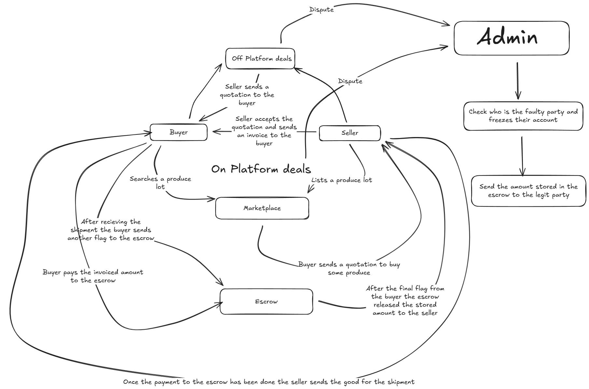

# 🧾 FinovatePay

# "Instant, Compliant On-chain Settlement for B2B Payments"


FinovatePay is a hybrid payment rail for small/medium businesses and marketplaces.  
It enables instant stablecoin payments, automated escrow, and tokenized invoice financing — all while ensuring KYC/AML compliance.  

⚡ Off-chain UX for speed and cost  
🔐 On-chain settlement and dispute resolution for security and auditability


## Getting Started

This guide helps new contributors set up FinovatePay locally.

### Prerequisites
- Node.js (v18+ recommended)
- npm or yarn
- MetaMask wallet
- Polygon RPC endpoint

### Clone the Repository
```bash
git clone https://github.com/<your-username>/FinovatePay.git
cd FinovatePay


## 🔧 Tech Stack

| 🧩 Layer            | ⚙️ Technology                                       
|---------------------|--------------------------------------------------
| 🖥️ Frontend         | React, Tailwind CSS                             |
| 🔙 Backend          | Node.js, Express.js                             |
| 📜 Smart Contracts  | Solidity (Hardhat on Polygon)        |


## 🚀 Core Features

- 🧾 Invoice Creation with digital signatures (off-chain + on-chain hash)
- 💸 Instant Payments using stablecoins into smart contract escrow
- 🔓 Escrow Release upon mutual confirmation or expiry
- ⚖️ Dispute Resolution via arbitrator/multisig with audit logs
- 🛡️ KYC/AML Compliance via wallet address mapping
- 💰 *(v2)* Invoice Financing using ERC-1155 fractional tokens


---

## 🚀 Polygon Buildathon: From Launch to Fundraising

Our project is designed to evolve with Polygon's "Launch to Fundraising" theme.

**Phase 1: Launch (Current Implementation)**
We have built a robust B2B trade finance platform on **Polygon PoS**. It solves critical cash flow problems for merchants using RWA-backed invoice financing and secure escrow payments, demonstrating immediate product-market fit.

**Phase 2: Scale (Our Vision)**
To achieve mass adoption, FinovatePay will evolve into a dedicated L2 for global trade, built using the **Polygon CDK**.

1.  **Dedicated Chain:** As a CDK chain, we can handle millions of invoices, offer gasless transactions for merchants, and build custom compliance modules directly into the chain logic.
2.  **AggLayer Integration:** Our CDK chain will connect to the **AggLayer**, making our platform's assets (like tokenized invoices) composable across the entire Polygon ecosystem.
3.  **Deep Liquidity with Katana:** We will connect our chain to **Katana** via the **WaltBridge**. This allows sellers on our platform to instantly finance their fractionalized RWA invoices by tapping into Katana's deep, productive liquidity pools. This solves the #1 problem for B2B merchants: **access to capital**.

---

## 🔐 Smart Contracts

- `🧾 InvoiceRegistry`: Registers invoice hash, metadata, and emits events
- `🔐 EscrowContract`: Holds payments, handles release and disputes
- `🚨 ComplianceManager`: Maps KYC status, handles freeze/flag logic
- `💸 FractionToken` *(v2)*: ERC-1155 tokens for invoice financing


## 💼 Monetization Model

| 💡 Stream                   | 💬 Description                                |
|----------------------------|-----------------------------------------------|
| 💰 Transaction Fee         | 0.1–0.5% per escrow payment                    |
| 📈 Invoice Financing Spread| Yield % from tokenized invoice investments    |
| 🛡️ Compliance / Insurance | Premium services for added security & audit   |


## 📚 Roadmap

| 🚀 Feature                         | 📍 Status       |
|----------------------------------|-----------------|
| MVP Payments + Escrow            | ✅ In Progress   |
| Tokenized Invoice Financing (v2) | 🔄 Planned       |
| Fiat On-Ramp Integration         | 🔄 Planned       |
| Smart Contract Audit             | 🔄 Planned       |